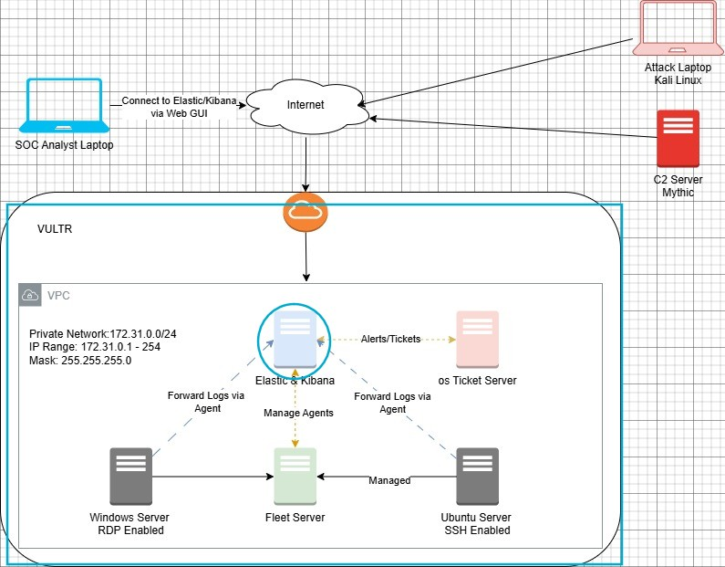

# MyDFIR 30-Day SOC Analyst Challenge Task 03
[Link to full briefing](https://www.youtube.com/watch?v=ypXARA5Uk4I) of Task 03  
Creator of Exercise: MyDFIR (Steven)

## Task:
Set-up of Elasticsearch Server

## Summary: 
Based on the Logical Diagram designed in Day 1:  

With Vultr, a Virtual Private Cloud needs to be designed for the focus of the five servers.
And alongside that, the first one to design in this task is the Elastic & Kibana one

#### More about Elasticsearch
**A recap from Day 2:**  
A database that is used to store logs (from Windows Event Logs, SysLogs, Firewall Logs amongst a few). 
Search across data, and uses ESQL as a query lang. 
Uses Restful API and JSON to interact with various application. 

#### Installation 
As per video - https://www.youtube.com/watch?v=ypXARA5Uk4I

### Credits:
Full credits to MyDFIR (Steven) for putting together this exercise

