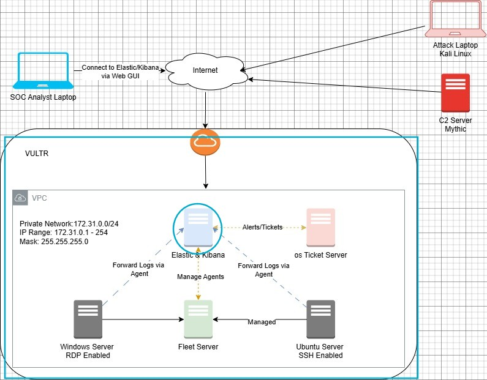

# MyDFIR 30-Day SOC Analyst Challenge Task 04
[Link to full briefing](https://www.youtube.com/watch?v=tXwMoBbrkYw) of Task 04  
Creator of Exercise: MyDFIR (Steven)

## Task:
Set-up of the Kibana Side on the Elasticsearch Server

## Summary: 
Based on the Logical Diagram designed in Day 1:  

With Vultr, a Virtual Private Cloud needs to be designed for the focus of the five servers.
And alongside that, the first server to design and complete is the Elastic & Kibana one. 
In Day 03's task, Elasticsearch has been installed and confirmed to be running when the service is enabled.

#### More about Kibana
**A recap from Day 2:**  
A data visualisation and exploration tool used for log data analysis. Uses a web console to query for logs stored within the Elasticsearch instance. 
Has various visualisation capabilities also.  

#### Installation 
As per video - https://www.youtube.com/watch?v=tXwMoBbrkYw

#### Some technical things to take note of:
1. Now that Kibana also has to sit in the same server, ensure secure connection into the virtual machine once again. With its public IP, username and password
2. Ensure apt-get update and apt-get upgrade are always executed after connection is established
3. Installation and reconfiguration of the Kibana package are executed as the Task video ~ Recollect commands like 'nano', 'cd', or for file executions in the same directory
4. Command of 'systemctl' to ensure kibana services are running
5. Enrollment token for elasticsearch to be used in Kibana, to keep safe
6. If needed, the firewall within the virtual machine might need a modification

More on [UFW commands](https://bitlaunch.io/blog/ufw-essentials-in-linux-key-commands-and-configurations/)

### Credits:
Full credits to MyDFIR (Steven) for putting together this exercise

