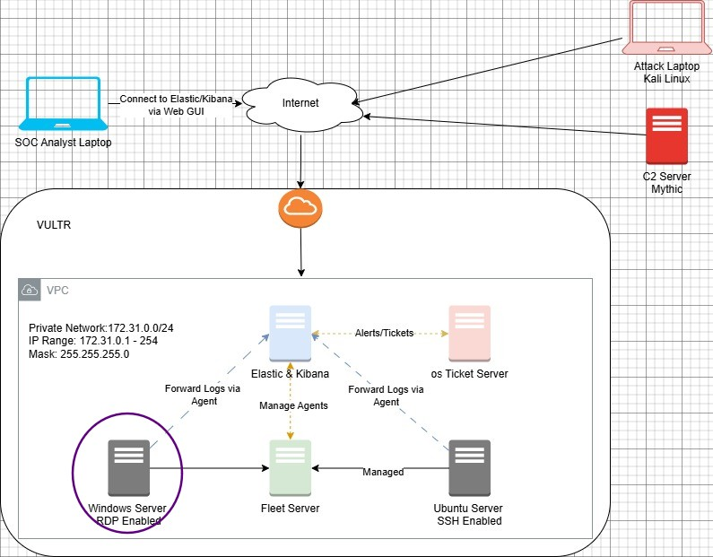
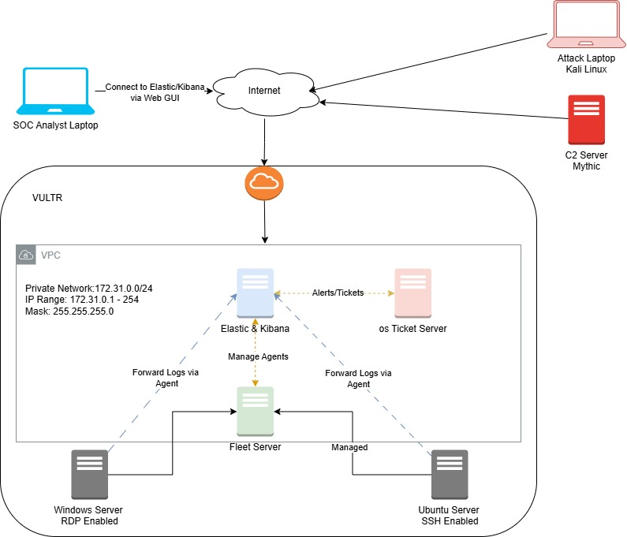

# MyDFIR 30-Day SOC Analyst Challenge Task 05
[Link to full briefing](https://www.youtube.com/watch?v=nBlCuLMq-zA) of Task 05  
Creator of Exercise: MyDFIR (Steven)

## Task:
Installation of Windows Server 2022

## Summary: 
Based on the Logical Diagram designed in Day 1:  

With Vultr, the next virtual machine to add is the Windows Server acting as a target machine for the challenge. 
When this virtual machine is going to act as our target for the challenge, it should not be included in the Virtual Private Cloud. 

That way, when exposed to the internet, the server could capture real life brute force attacks via RDP. 

Therefore, the altered Drawio diagram, should be looking like this:  

#### Installation 
As per [video](https://www.youtube.com/watch?v=nBlCuLMq-zA)

### Credits:
Full credits to MyDFIR (Steven) for putting together this exercise

