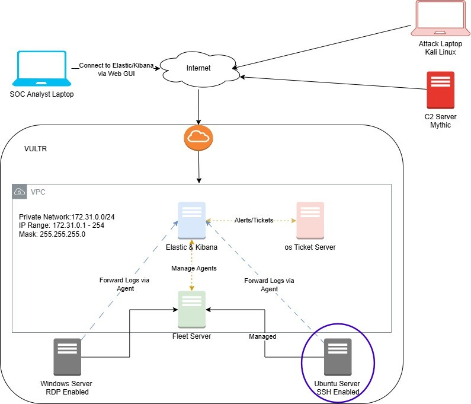
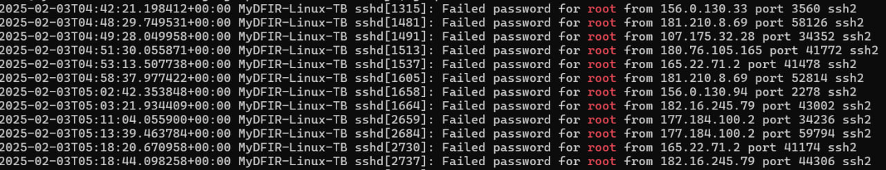

# MyDFIR 30-Day SOC Analyst Challenge Task 12
[Link to full briefing](https://www.youtube.com/watch?v=qsMhmXIqWfc) of Task 12  
Creator of Exercise: MyDFIR (Steven)

## Task:
Set up of Ubuntu Server

## Summary: 
In recap from our Logical Diagram:  

The focus of today's task is in the Ubuntu Server. To note, this is out of the Virtual Private cloud, and firewall, and is exposed to the internet. 
Within a few minutes of this set-up, various login attempts would be captured. 

## Set up and Walk through of capturing login activity
As per [video](https://www.youtube.com/watch?v=qsMhmXIqWfc)

A small snapshot of what to expect:  

### Credits:
Full credits to MyDFIR (Steven) for putting together this exercise

