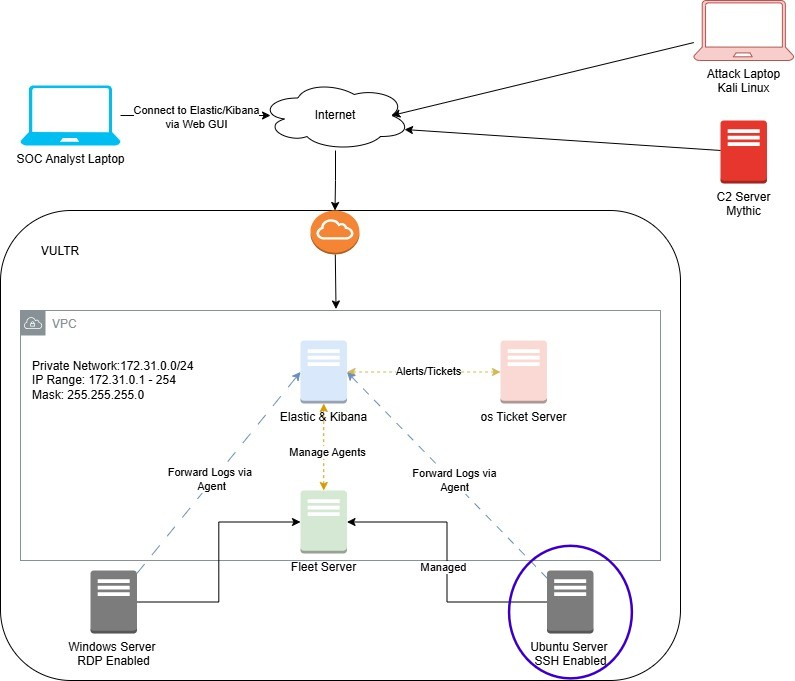
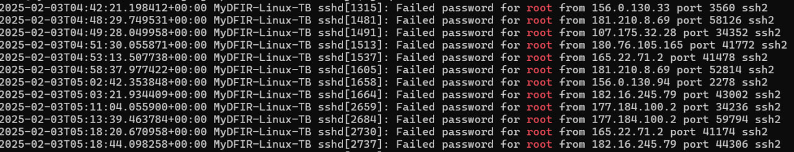

# MyDFIR 30-Day SOC Analyst Challenge Task 13
[Link to full briefing](https://www.youtube.com/watch?v=QHJr2-Kav4k) of Task 13  
Creator of Exercise: MyDFIR (Steven)

## Task:
Set up of Elastic Agent onto Ubuntu Server

## Summary: 
From last week, we have set up our SSH enabled Ubuntu server:  

And within a few minutes of its installations, we've seen attempts of trying to log into it:

To analyse these brute force attacks better, it's best to also publish this server's telemetry into the Web GUI of the ELK server. 
Once again, this server needs an Elastic agent installed inside it, and ensure it's communicating with the ELK server to forward its logs over.

### Installation
As per [video](https://www.youtube.com/watch?v=QHJr2-Kav4k)

### Credits:
Full credits to MyDFIR (Steven) for putting together this exercise

