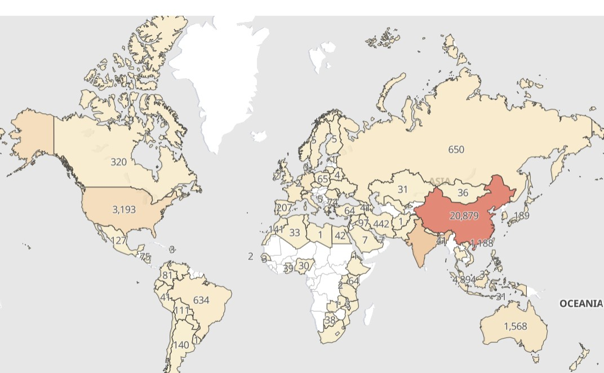

# MyDFIR 30-Day SOC Analyst Challenge Task 14
[Link to full briefing](https://www.youtube.com/watch?v=AdUMhT1l1eY) of Task 14  
Creator of Exercise: MyDFIR (Steven)

## Task:
Creating alerts and dashboards of SSH Brute Force Attacks

## Summary: 
Over the last few days, we've seen our SSH Server get hit with many brute force attempts. 
But one "filter" to apply for these attempts, is that there is only one username for our Ubuntu Server that's valid. 

Which means there are failed attempts, with one credential being correct: the username. 
In this task, the goal is to create an alert and a global dashboard of where these attacks would be originating from. 

### Installation
As per [video](https://www.youtube.com/watch?v=AdUMhT1l1eY)

### Example of dashboard

### Credits:
Full credits to MyDFIR (Steven) for putting together this exercise

