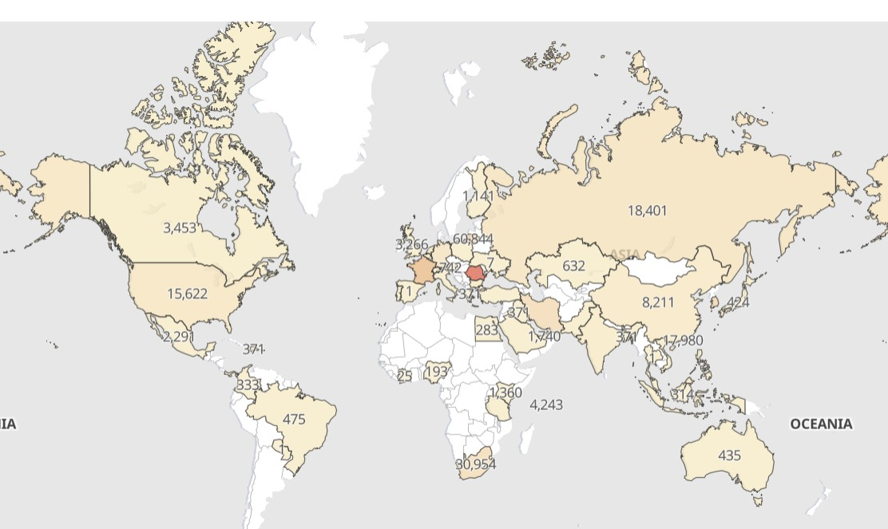

# MyDFIR 30-Day SOC Analyst Challenge Task 16
[Link to full briefing](https://www.youtube.com/watch?v=11eBIfDeZ7k) of Task 16  
Creator of Exercise: MyDFIR (Steven)

## Task:
Creating alerts and dashboards of Brute Force Attacks against the Windows Server

## Summary: 
Similar to our SSH enabled Ubuntu Server, our RDP enabled Windows Server would've also been hit by brute force attempts.
Also like the Ubuntu Server, there is only one username for our Windows Server that's valid. 

Which means there are failed attempts, with one credential being correct: the username. 
In this task, the goal is to create an alert and a global dashboard of where these attacks would be originating from. 

In Kibana, elements of the Sysmon logs will be utilised instead. (Previously, in Day 14, for the Ubuntu server, it was system.<>.<> logs).

### Installation
As per [video](https://www.youtube.com/watch?v=11eBIfDeZ7k)

### Example of dashboard

### Credits:
Full credits to MyDFIR (Steven) for putting together this exercise

