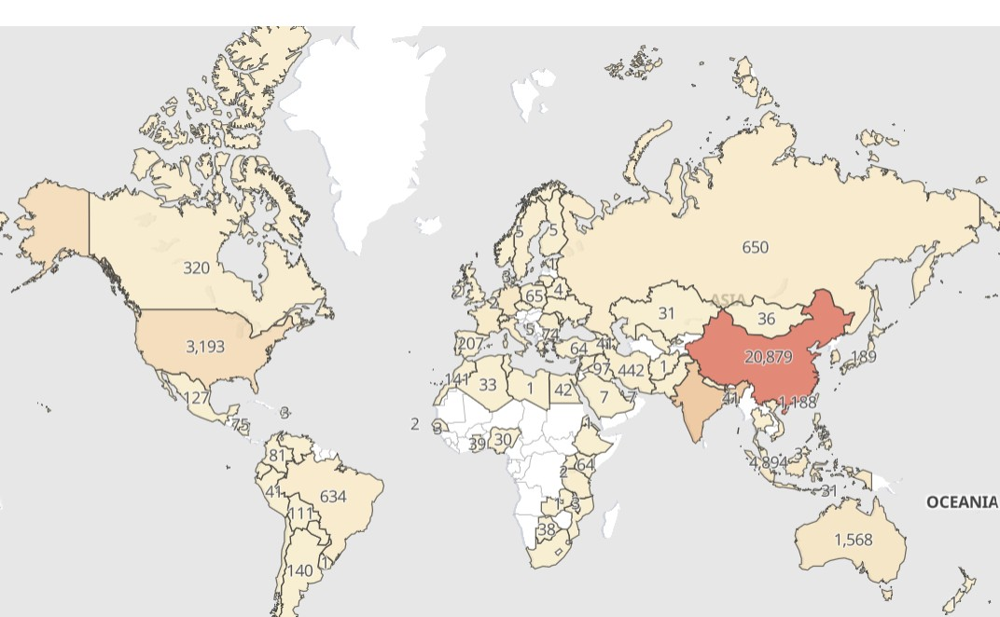
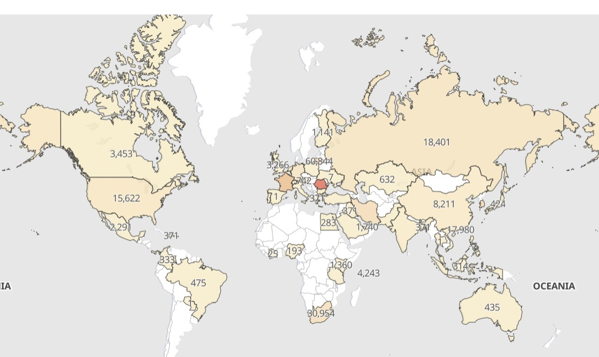

# MyDFIR 30-Day SOC Analyst Challenge Task 17
[Link to full briefing](https://www.youtube.com/watch?v=pAfIi6Z6a2g) of Task 17  
Creator of Exercise: MyDFIR (Steven)

## Task:
Creating a more comprehensive Dashboard for failed and successful attempts of logging into SSH and Windows Server

## Summary: 
From Days 14 and 16, it was possible to create a dashboard of failed authentication attempts to our Windows and Ubuntu Servers:

#### Failed SSH attempts

#### Failed RDP attempts

In this task, more comprehensive dashboards can be designed to get a more detailed picture of these events. 

## Procedure:
As per [video](ttps://www.youtube.com/watch?v=pAfIi6Z6a2g)

### Credits:
Full credits to MyDFIR (Steven) for putting together this exercise

