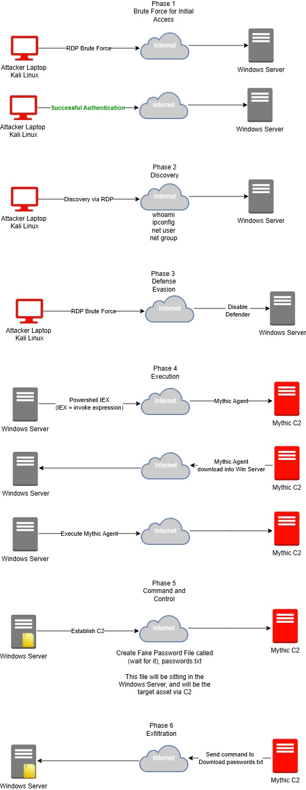

# MyDFIR 30-Day SOC Analyst Challenge Task 19
[Link to full briefing](https://www.youtube.com/watch?v=jv-qiugJGHg) of Task 19  
Creator of Exercise: MyDFIR (Steven)

## Task:
Creating an Attack Diagram that maps out your plan of attack.  
This attack diagram will walk one through on how one plans on attacking a target machine, and the next steps after compromising and establishing a C2 connection. 

### Diagram Creation
Resource used (Same as from Day 01): [Draw.io](https://www.drawio.com/) 

A fuller version in PDF is in this folder.

### Credits:
Full credits to MyDFIR (Steven) for putting together this exercise

