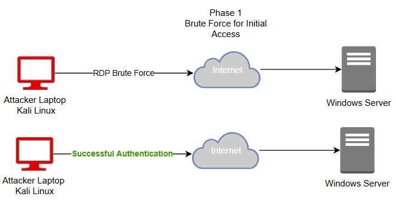
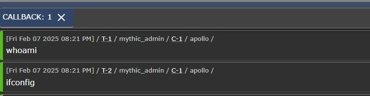
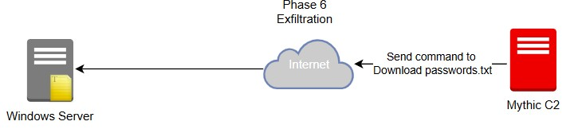

# MyDFIR 30-Day SOC Analyst Challenge Task 21
[Link to full briefing](https://www.youtube.com/watch?v=85x0NLj2zUo) of Task 21  
Creator of Exercise: MyDFIR (Steven)

## Task:
Almost ready to try and execute a model cyber attack on our created system.  
But before that, some small tasks are required to be done:  
1. Changing our Windows Server's password, and having that password stored somewhere in its system in a text file, as our target asset.  
2. To simulate a brute force attack, another common passwords list that would be sitting in our Kali Linux VM  

### Small Task 1: Changing our Windows VM's password
Logging into our Windows Server from Vultr, choose a directory where the machine's password file will be sitting. In my demo walkthrough, it's in Documents, and will be called Passwords_Q1_2025.txt . 

Pick a unique password and keep that value into the text file. 
After that, change the password of the Windows machine to the value chosen. (shown in video from [here](https://youtu.be/85x0NLj2zUo?si=Vyn-M3wv6zoudZ_E&t=140))

Keep a copy of that value too, as you will need it in the 2nd small task next. 

### Small Task 2: Installing and Configuring Attack Laptop VM (Kali Linux)
Kali Linux should be installed from Day 20. Log into the Kali VM on the workstation.

To simulate a list of common passwords, Kali provides a collection of passwords for our usage. To navigate to that, see video from [here](https://youtu.be/85x0NLj2zUo?si=iq6ll5sVEPJxt2uc&t=264), and append the password from Small Task 1 to it. 

The final result would be a customised password list created from Kali's issued list of common passwords, with the Small Task 1's passwords appended to it, at the bottom. 

You can use `tail -5 custom-password-listname.txt` to ensure it's added in successfully. This command helps print the last 5 passwords of the list.  

### Executing a Model Cyber Attack
#### Phase 1 - Initial Access
Now that both small tasks are done, the next thing is to now start simulating the cyberattack. What the stages of this cyber attack are mentioned and designed in Day 19. 

To begin, the first phase is Initial Access. 

The set-up for this begins a little bit after the creating the custom passwords list. The first step will involve installation of the crowbar package. 

Crowbar helps us simulate a brute force attack with the custom-password list created to enter our Windows Machine. Details you will require is the username in the Windows machine 
(if followed along in the series, there's only one username), its IP address assigned by Vultr, and the name of the custom passwords file. 

The command to simulate the attack looks like this:  
`crowbar -b rdp -u Username-in-Windows -C custom-password-listname.txt -s <IP Address of Windows Server>/32`
The flags of the commands represent the following:  

1. -b = bruteforce attack to be executed with a certain protocol or application. 
2. -u = username. A small "u" flag is used if there's one static username for the machine. Else, it's a "U" to try multiple usernames
3. -C = password file. Capital C as its meant to represent the usage of multiple passwords from the file. 
4. -s = For a single target's IP address. 

When successful, a message like below would appear, with the Public IP - Password in plaintext form:

The password would be the one of the same value from Small Task 1. 

Now, it's understood what password value works from the Kali Linux machine (the attacker's device). In order for the Kali Linux VM to truly access the 
target machine, the next command run is done with the tool, xfreerdp.

The command will look like this: `xfreerdp /u: Username-in-Windows /p: <Password found in previous command> /v: <IP Address of Windows Server>:<Port Number>`

The end result would be seeing the Windows Server's desktop from the Kali Linux VM. 

Now, Phase 1, Initial Access is completed. Onwards to Phase 2. 

#### Phase 2 - Discovery
Now that access into the Windows Server is done, the next thing to do is to run some discovery commands. 

That's in this [portion of the video](https://youtu.be/85x0NLj2zUo?si=SlV1SwA49B3cb5_D&t=660). 

Executing these commands is to simulate what the common discovery commands are used, and to create telemetry. 
These would act as "signs" of a compromise in IR later. 

Onward to Phase 3. 

#### Phase 3: Defense Evasion 
In order to make our Windows Server vulnerable to "attacker" inputs from our Kali VM, Windows Defender can be disabled. 
That's done as shown [here](https://youtu.be/85x0NLj2zUo?si=UWndd_7UyUNA5j5O&t=731). 

After that, Phase 4. 

#### Phase 4: Execution
The next step is Execution. But execute what? This requires creating a payload. Which can be done inside our Mythic Server (installed in Day 20, and invoking a Web GUI). 

In case you've started Day 21's activities after logging out from all servers after completing Day 20, this is the series of commands to run to enter back the Mythic Server. 
This will mean dependencies like Docker-compose, Mythic and Make are working in this machine and credentials to enter the GUI are in reach. 

Series of commands:  
1. ssh root@Public-IP-of-Mythic-Server
2. apt-get update && apt-get upgrade -y
3. cd Mythic
4. make
5. systemctl status Docker (should be successfully running)
6. ./mythic-cli start

And then enter the Web GUI with http://Public-IP-of-Mythic_Server:7443

Once inside the server, proceed with the installation of Mythic agents. That portion of video will begin [here](https://youtu.be/85x0NLj2zUo?si=80VSIO60jeAX8aJB&t=770)

Sources used here:
i. [For Mythic Agents](https://github.com/mythicagents)  

The end goal of this phase is to ensure the payload created is Running (can be checked via Task Manager). 

When this is visible, it's possible to move onto Phase 5. 

#### Phase 5: Command and Control
Now that the executable is running in our target Windows Server, it can now accept commands or keystrokes from our attack Linux machine. 
For this, it will involve reverting back to the Mystic GUI, and following along from this [point of the video](https://youtu.be/85x0NLj2zUo?si=cXkKqrGehVDlAuCQ&t=1420)

With a few commands tested out, and if details are received back, then it's proof that the C2 connection is working between the Mythic Server and Target machine. 

After this, the last is to exfiltrate out the password file from our Windows Server. 

#### Phase 6: Exfiltration

For this, a download command is used `download [path to Password file in Windows Machine]`. When received, it will get reflected into the Mystic GUI like so:  

That is then noted as a successful exfiltration of our target asset from the Windows Server.

### Firewall settings
For this exercise, it's best to make sure the Mythic server is only open to talking to our target machines (the Windows Server, Ubuntu Server) and our workstartion machine (in case there are extra commands or packages to install to the Mythic Server). One extra firewall will be configured for that for our "attacker" infrastructure. 

### Installation
As per [video](https://www.youtube.com/watch?v=JKO1pZ45_5I)

### Credits:
Full credits to MyDFIR (Steven) for putting together this exercise

