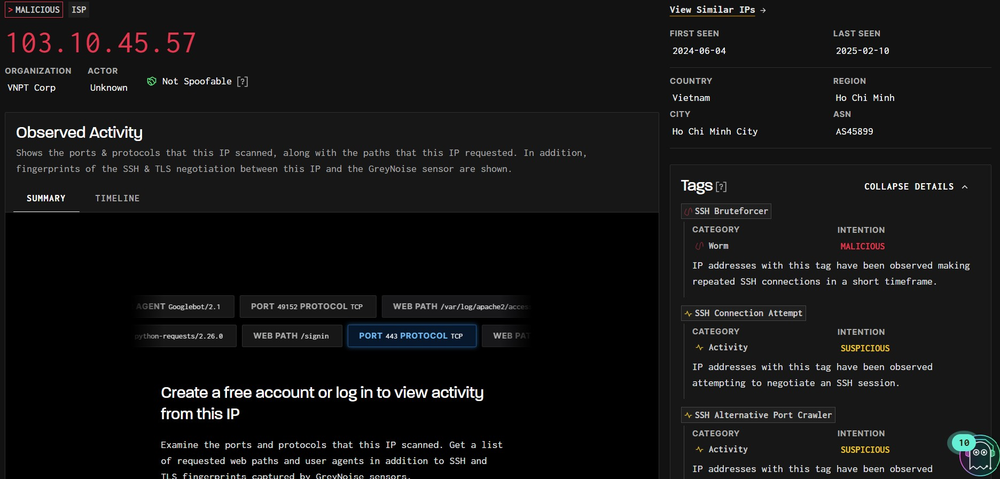
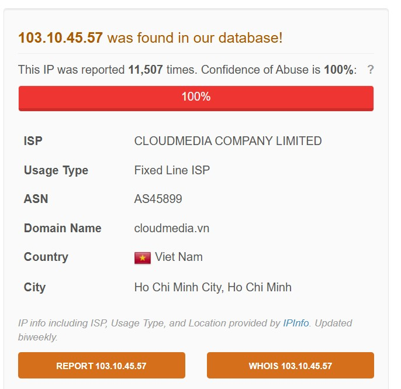

# MyDFIR 30-Day SOC Analyst Challenge Day 26
[Link to full briefing](https://www.youtube.com/watch?v=sXQ1hsAFX7U) of Day 26  
Creator of Exercise: MyDFIR (Steven)

## Task:
To investigate Brute Force attacks against SSH server. 

### Installation
As per [video](https://www.youtube.com/watch?v=sXQ1hsAFX7U). 

Resources that help in this task:
1. [AbuseIPDB](https://www.abuseipdb.com/)
2. [GreyNoise](https://viz.greynoise.io/)

In the case of brute forcing with SSH, a successful attempt will mean using "root" as a username and plugging in THE password of the server. 
Up until now, that password has not been inserted. So to get some insights about who is attempting to brute force, from ELK, the logs that will be 
more interesting to investigate are the ones where the username is "root". 

Here's one such example of an attempted brute force into the SSH server.

Some insights gathered about the IP address from these sources. 

#### GreyNoise

#### AbuseIPDB

#### Additional Resources to Explore for this:
Cybersecurity SOC Analyst Lab - [Brute Force (SSH)](https://youtu.be/8sJCzoCGexE?si=qvI-Y46snxi0MAH_)
It's a whole other series of alerts and Labs that a SOC Analyst might encounter when dissecting alerts or attacks. 

### Credits:
Full credits to MyDFIR (Steven) for putting together this exercise

