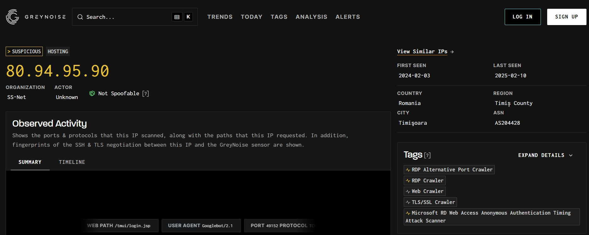
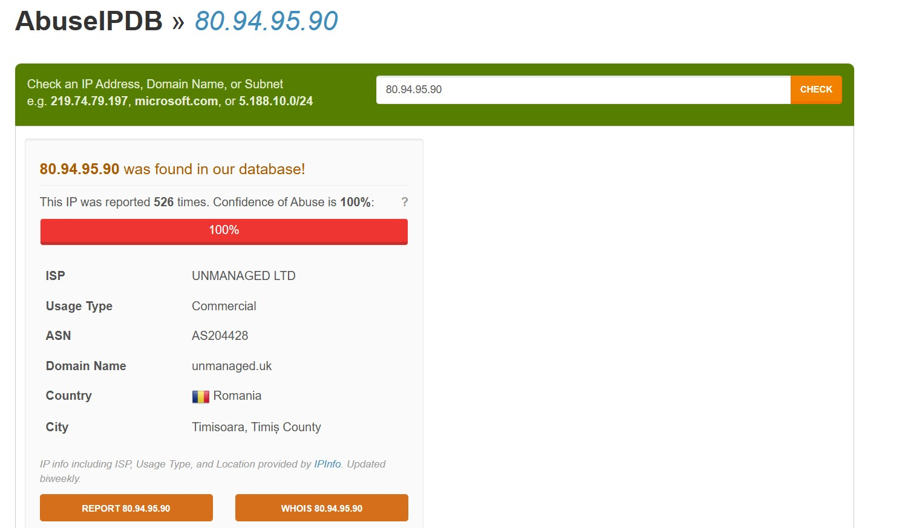

# MyDFIR 30-Day SOC Analyst Challenge Day 27
[Link to full briefing](https://www.youtube.com/watch?v=l9KA6dPdOs8) of Day 27  
Creator of Exercise: MyDFIR (Steven)

## Task:
To investigate Brute Force attacks against our Windows server. 

### Investigation Method
As per [video](https://www.youtube.com/watch?v=l9KA6dPdOs8). 

Resources that help in this task:
1. [AbuseIPDB](https://www.abuseipdb.com/)
2. [GreyNoise](https://viz.greynoise.io/)

In the case of brute forcing with RDP, a successful attempt will mean using "Administrator" as a username and plugging in THE password of the server. 
Up until now, that password has not been inserted. So to get some insights about who is attempting to brute force, from ELK, the logs that will be 
more interesting to investigate are the ones where the username is "Administrator". 

#### From GreyNoise

#### From AbuseIPDB

#### Additional Resources to boost up on this:
This was a bit challenging for me to understand Windows Logs and figuring out what were important logs to filter out. 
One potential video to supplement would be [Logjammer](https://www.youtube.com/watch?v=7PzMYcPPLjE&list=PLG6KGSNK4PuDdqYkOuIlAoNmwtLg5wyYJ&index=11)

### Credits:
Full credits to MyDFIR (Steven) for putting together this exercise

