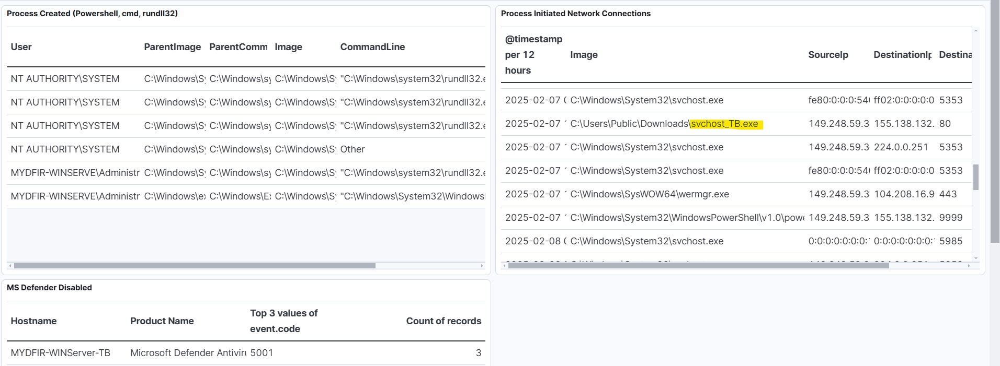

# MyDFIR 30-Day SOC Analyst Challenge Day 28
[Link to full briefing](https://www.youtube.com/watch?v=b11TuDx_CjU) of Day 28  
Creator of Exercise: MyDFIR (Steven)

## Task:
To investigate the telemetry created by Mythic Agent

### Summary
Our Mythic agent was used to create a C2 channel. Typically, when a C2 channel gets established, a lot of back and forth might tend to happen. 

One such tool for detection is called [RITA](https://www.blackhillsinfosec.com/projects/rita/). 

But in this challenge, the key metrics to look out for include process creations and network creations. 

### Food for thought
In this challenge, we knew what we called our customised executable when packaging it in Mythic. And can narrow out the suspicious activity using that file name like so:  

In case that file name wasn't known, one other thing to investigate would've been why an executable was attempting to connect to an external IP.
From there, the walkthrough shows how an investigation would go about from that point. 

### Procedure
As per [video](https://www.youtube.com/watch?v=b11TuDx_CjU). 

### Credits:
Full credits to MyDFIR (Steven) for putting together this exercise

